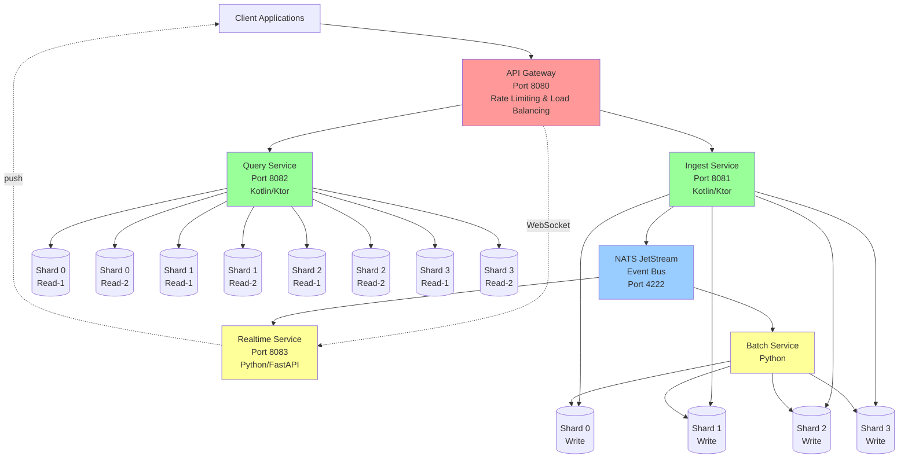
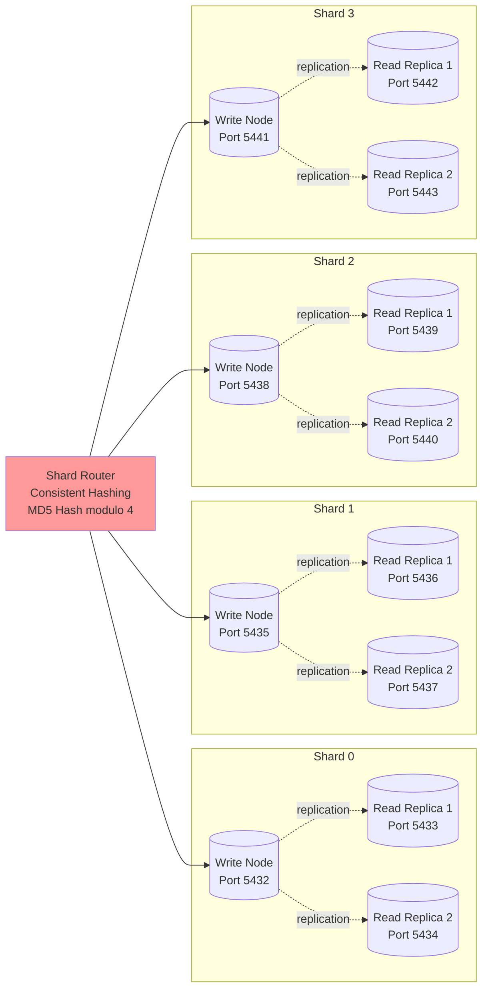
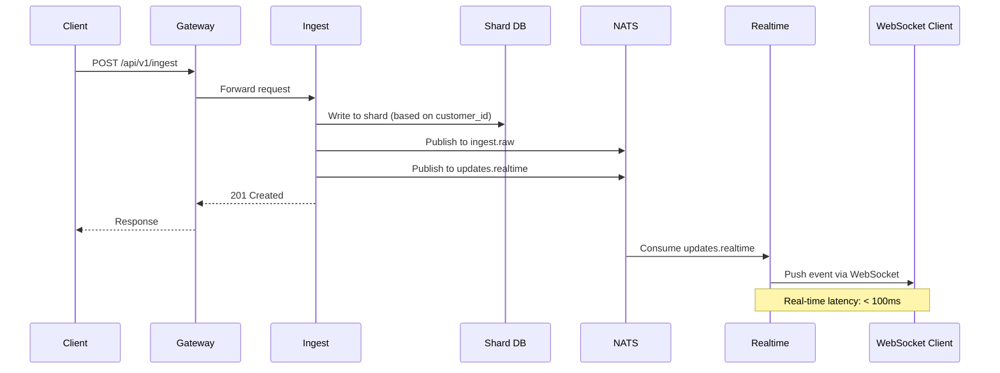
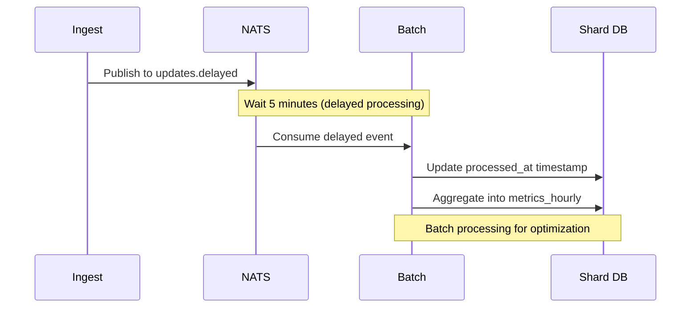
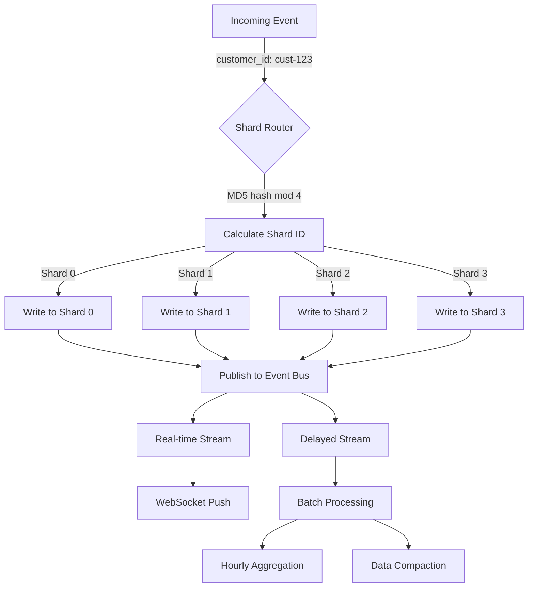
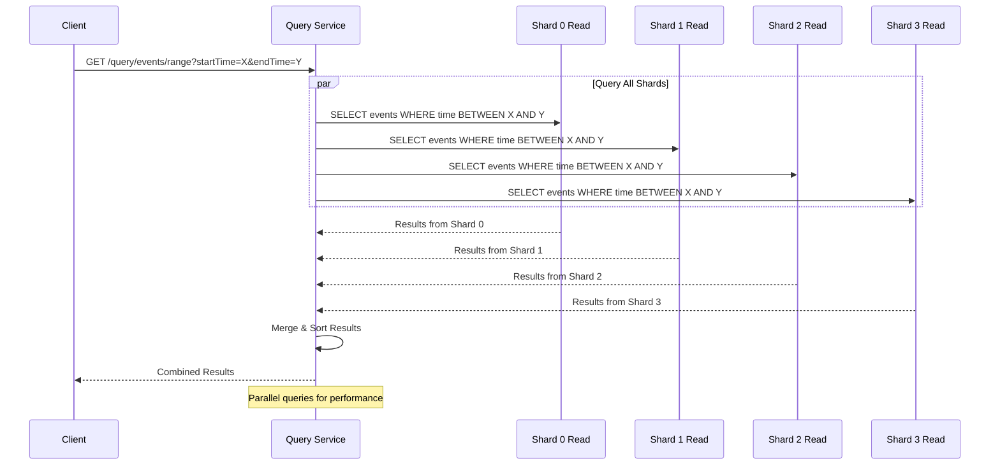
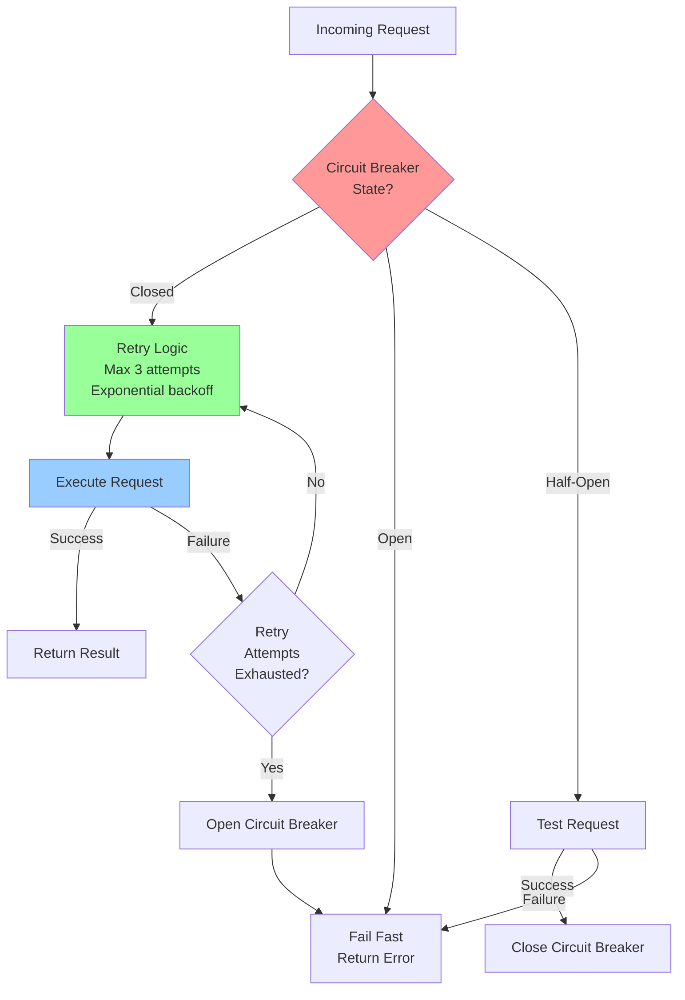
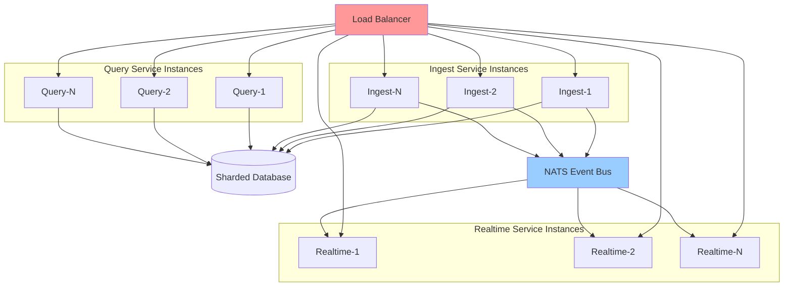

# ShardStream Architecture Diagrams

## System Architecture

## Shard Topology

## Event-Driven Pipelines

### Real-time Pipeline

### Delayed Pipeline

## Data Flow

## Scatter-Gather Query Pattern

## Resilience Patterns

## Horizontal Scaling

